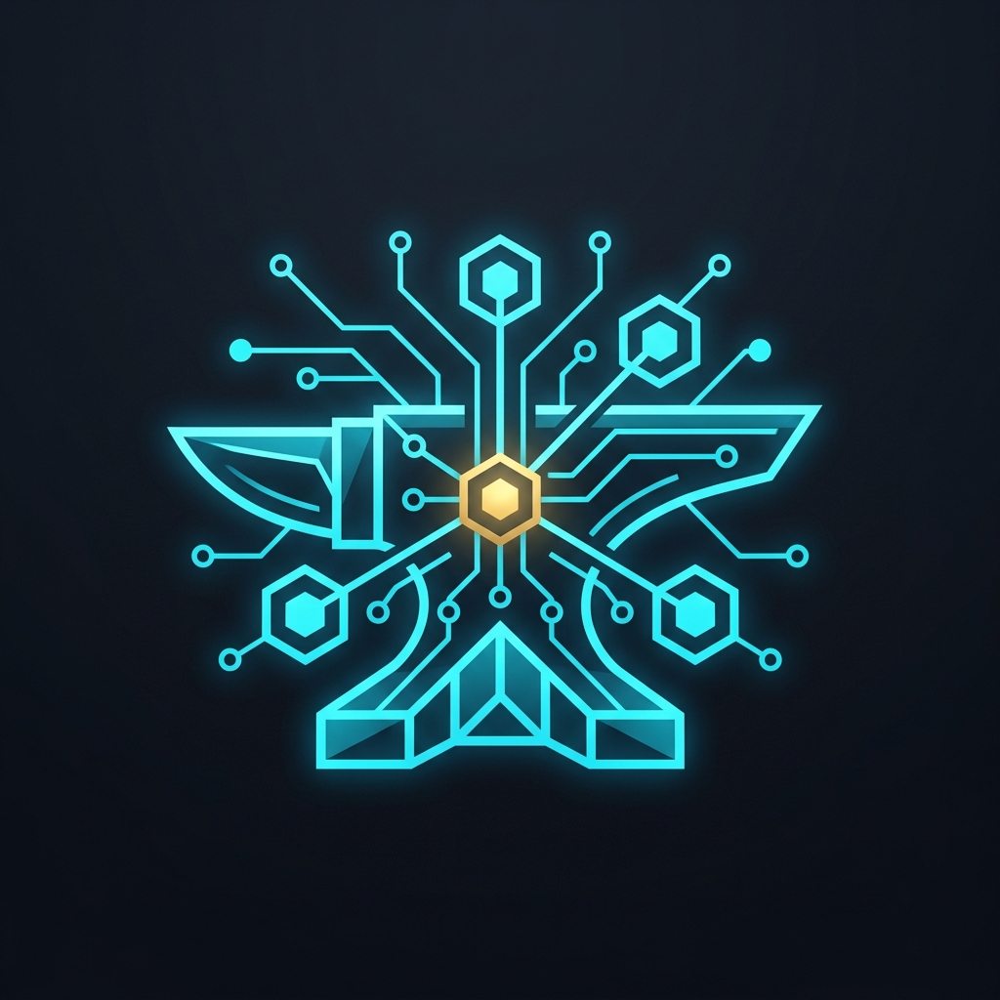
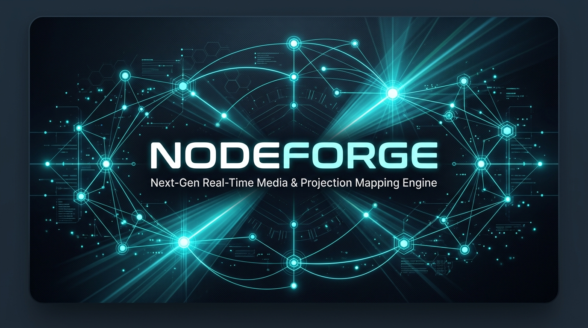

<div align="center">



# NodeForge

### *Next-Generation Real-Time Media, 3D Generative Graph & Projection Mapping Engine*

[](https://isocpp.org/)
[](https://www.vulkan.org/)
[](https://github.com/ocornut/imgui)
[](https://www.python.org/)
[](https://cmake.org/)
[](https://github.com/Waleed-Khalid-dev/Nodeforge/actions)
[](https://github.com/google/googletest)
[](https://microsoft.com/windows)
[](sdk/README.md)
[](#license)

<br />

[✨ Core Capabilities](#-core-capabilities) •
[🏗️ Architecture](#️-architecture) •
[🧩 Operator Ecosystem](#-operator-ecosystem) •
[🌌 Particle Simulation](#-gpu-compute-particles) •
[📽️ Flagship Showcases](#-flagship-production-showcases) •
[🔌 Plugin SDK](#-plugin-sdk--extensibility) •
[⚡ Quick Start](#-quick-start) •
[📦 Packaging & Distribution](#-packaging--distribution) •
[🗺️ Phase Roadmap](#️-phase-roadmap) •
[📜 Clean-Room Standard](#-clean-room--legal-hygiene)

<br />



</div>

---

## 📖 Executive Summary

**NodeForge** is a high-performance, clean-room, C++23 / Vulkan 1.3 real-time visual development engine architected from the ground up for **façade-scale architectural projection mapping**, **interactive holograms**, **million-particle GPU physics swarms**, **walkable 3D floor plans**, and **ultra-low-latency show control**. 

Engineered for **Neo Realms**, NodeForge delivers professional-grade DAG execution, sub-millisecond dirty propagation, zero-allocation GPU texture leasing, embedded Python 3.11 scripting, multi-display Bezier grid warping with gamma-correct softedge blending, a versioned C/C++23 binary Plugin SDK with dynamic hot-reloading, dedicated sub-microsecond profiling diagnostics, and a lightweight standalone kiosk runtime (`nodeforge_player.exe`).

---

## ✨ Core Capabilities

<table>
<tr>
<td width="50%" valign="top">

### 🎨 GPU Texture Processing (`TexOp`)
- **Vulkan 1.3 Dynamic Rendering** with zero render-pass boilerplate.
- **Zero-Allocation Texture Leasing Pool** preventing GPU memory fragmentation across continuous multi-hour installations.
- **Runtime SPIR-V Shader Compilation** with live hot-reload support.
- **Zero-Copy Interop** via Spout2 GPU texture sharing and NDI 6 network video streaming.

</td>
<td width="50%" valign="top">

### 📽️ Multi-Projector Mapping Suite
- **Multi-Output Window Engine** routing independent render views to multiple physical projector outputs.
- **2D Bezier Patch & Grid Warper** with interactive on-screen control points and serialized `.nfc` configs.
- **S-Curve Gamma Softedge Blending** for seamless overlapping projections with black-level pedestal compensation.
- **On-Site Calibration Overlay** for fast field alignment.

</td>
</tr>
<tr>
<td width="50%" valign="top">

### 🌌 GPU Compute Particles (`GeomOp` / `MatOp`)
- **Vulkan 1.3 Compute Physics Pipeline** simulating over **1,000,000 active particles at 60+ FPS**.
- **3D Simplex Curl Turbulence Noise** for organic, mass-conserving fluid motion.
- **Dynamic Point Attractors/Repulsors** driven by OSC LiDAR and hand-tracking coordinates.
- **Point-Sprite & Billboard Quad Materials** with soft circular Gaussian falloff and depth fading.

</td>
<td width="50%" valign="top">

### 📐 3D Geometry, Materials & Scene Graph
- **Procedural Geometry Engine (`GeomOp`)** supporting Grids, Spheres, Boxes, Tori, Cylinders, Noise Deformation, Normal calculation, and Mesh Merging.
- **Unified Material System (`MatOp`)** with Unlit Constant, Blinn-Phong, and custom runtime GLSL shaders.
- **Dual-Source GPU Instancing (`GeometryComp`)** driven by numeric channels or tabular data.
- **Dynamic 3D Camera & Light Comps** rendered straight into downstream 2D texture networks.

</td>
</tr>
<tr>
<td width="50%" valign="top">

### 🎛️ Protocols, SIMD Channels & Show Control
- **SIMD Channel Processing (`ChanOp`)** operating on planar, cache-coherent `ChannelBuffer` memory.
- **Real-Time Show Control Protocols**:
  - **MIDI:** WinMM async subsystem, CC/Note/PitchBend/Aftertouch with zero-lock snapshot extraction.
  - **OSC:** High-frequency UDP packet parser with decay/hold smoothing.
  - **Serial:** Win32 Overlapped async I/O worker thread for microcontrollers.
  - **Art-Net 4 DMX512:** UDP Port 6454 broadcaster/receiver across 32,768 universes.

</td>
<td width="50%" valign="top">

### 🔌 Binary Plugin SDK & Dynamic Operators
- **Stable `extern "C"` ABI (`nf_plugin_abi.h`)** with version handshakes (`NF_PLUGIN_ABI_VERSION = 1`).
- **Modern C++23 Header-Only SDK (`NodeForgePluginSDK.hpp`)** with RAII wrappers and strict exception boundary isolation.
- **Multi-Family Support:** Custom GPU compute/raster TexOps, SIMD ChanOps, and tabular DataOps.
- **Multi-Directory Auto-Discovery & Hot-Reload:** In-session DLL reloading without graph interruption.

</td>
</tr>
</table>

---

## 🏗️ Architecture

NodeForge employs a hybrid execution model designed for deterministic real-time multimedia workloads:

```
                                  ┌───────────────────────────┐
                                  │      NodeForge Studio     │
                                  │ (ImGui Canvas / Inspector)│
                                  └─────────────┬─────────────┘
                                                │
                                                ▼
                                  ┌───────────────────────────┐
                                  │    Graph DAG Runtime      │
                                  │  - Push Dirty Push-Down   │
                                  │  - Pull-on-Demand Cook    │
                                  │  - Kahn Topo-Sort Order   │
                                  └─────────────┬─────────────┘
                                                │
                 ┌──────────────────┬───────────┴───────┬──────────────────┐
                 ▼                  ▼                   ▼                  ▼
          ┌─────────────┐    ┌─────────────┐     ┌─────────────┐    ┌─────────────┐
          │   TexOps    │    │   GeomOps   │     │   ChanOps   │    │   DataOps   │
          │ (Vulkan 1.3)│    │ (Particles) │     │ (SIMD AVX2) │    │  (Tables)   │
          └──────┬──────┘    └──────┬──────┘     └──────┬──────┘    └──────┬──────┘
                 │                  │                   │                  │
                 └──────────────────┴───────────┬───────┴──────────────────┘
                                                │
                                                ▼
                                  ┌───────────────────────────┐
                                  │   Hardware I/O & Show     │
                                  │ (Spout/NDI/MIDI/OSC/DMX)  │
                                  └───────────────────────────┘
```

- **Push-Dirty, Pull-Cook Evaluation:** Parameter edits and dynamic time pulses invalidate downstream paths instantly without executing unneeded subnets.
- **Topological Sorting:** Guarantees deterministic, cycle-free node cook order.
- **Zero-Allocation GPU Memory:** Textures lease VMA memory blocks from a thread-safe `TexturePool` and return them immediately at frame boundaries.
- **Safe Python GIL Sandbox:** Embedded Python 3.11 evaluates expressions and automation callbacks via pybind11 with full exception safety.

---

## 🧩 Operator Ecosystem (64+ Core Operators)

NodeForge organizes operators into 6 distinct, color-coded node families:

| Family | Accent Color | Primary Data Type | Key Operators |
|:---:|:---:|:---:|:---|
| **TexOp** | **Cyan** | 2D GPU Textures | `Noise`, `Blur`, `Composite`, `Level`, `Transform`, `Resolution`, `MovieFileIn`, `VideoDeviceIn`, `SpoutIn/Out`, `NDIIn/Out`, `ProjectorOut`, `WarpBlend`, `Render` |
| **GeomOp** | **Blue** | 3D Meshes & Particles | `Grid`, `Sphere`, `Box`, `Torus`, `Cylinder`, `Transform`, `Merge`, `NoiseDeform`, `Normals`, `ChanToGeom`, `ParticleEmitter`, `ParticleForce`, `ParticleAttractor` |
| **ChanOp** | **Green** | 1D SIMD Channels & Audio | `Constant`, `Time`, `LFO`, `Noise`, `Math`, `Filter`, `Merge`, `Select`, `Trail`, `AudioFileIn`, `MIDIIn/Out`, `OSCIn/Out`, `DMXIn/Out`, `MouseIn`, `KeyboardIn` |
| **DataOp** | **Pink** | 2D Tabular & Text | `Table`, `Text`, `Script`, `JSON`, `Select`, `Merge`, `OSCIn/Out`, `Web`, `Serial`, `ChanToData`, `DataToChan` |
| **MatOp & 3D Comps** | **Gold / Gray** | Materials & Scene | `ConstantMat`, `PhongMat`, `GLSLMat`, `ParticleMat`, `CameraComp`, `LightComp`, `GeometryComp` |
| **Comp** | **Orange** | Subnetworks & Plugins | `ContainerComp`, `InOp`, `OutOp`, `PluginProxyNode` |

---

## 📽️ Flagship Production Showcases (`samples/`)

NodeForge includes 5 production-ready flagship template projects engineered for live enterprise shows:

1. **[`samples/01_facade_mapping`](samples/01_facade_mapping)** — Dual-projector architectural façade mapping show featuring real-time generative GPU noise, 2-pass separable Gaussian glow, 2D Bezier grid warping, S-curve gamma softedge blending, and dual window physical output routing.
2. **[`samples/02_interactive_floorplan`](samples/02_interactive_floorplan)** — 3D walkable architectural floor plan with OSC visitor tracking, dynamic avatar mesh transform, procedural geometry merging, Phong lighting, and GPU rasterized rendering.
3. **[`samples/03_audiovisual_stage`](samples/03_audiovisual_stage)** — Live audio-reactive generative visual synthesizer driven by ChanOp audio analysis and live MIDI CC controls.
4. **[`samples/04_dmx_showcontrol`](samples/04_dmx_showcontrol)** — Art-Net 4 DMX512 lighting matrix controller with Serial microcontroller telemetry and keyboard cue switching.
5. **[`samples/05_holographic_particles`](samples/05_holographic_particles)** — High-density GPU compute particle swarm simulation driven by OSC hand tracking gesture attractors, 3D curl noise turbulence, and additive bloom glow.

---

## 📚 Operator Cheat Sheets & Training

NodeForge provides a complete documentation suite for creative technologists and system engineers:

- **Cheat Sheets:** [Master Reference](docs/cheat-sheets/00_master_cheat_sheet.md) • [TexOp](docs/cheat-sheets/01_texop_cheat_sheet.md) • [ChanOp](docs/cheat-sheets/02_chanop_cheat_sheet.md) • [DataOp](docs/cheat-sheets/03_dataop_cheat_sheet.md) • [GeomOp](docs/cheat-sheets/04_geomop_cheat_sheet.md) • [MatOp](docs/cheat-sheets/05_matop_scene_cheat_sheet.md) • [Comp System](docs/cheat-sheets/06_comp_system_cheat_sheet.md) • [Particles](docs/cheat-sheets/07_particles_cheat_sheet.md)
- **Workshop Curriculum:** [6-Module Hands-On Training Syllabus](docs/training/workshop_curriculum.md)
- **Interactive Labs:** [Lab 1: Generative Graphics](docs/training/lab_01_generative_graphics.md) • [Lab 2: 3D Pipelines](docs/training/lab_02_3d_render_pipelines.md) • [Lab 3: Projection Mapping](docs/training/lab_03_projection_mapping.md) • [Lab 4: Show Control](docs/training/lab_04_interactive_controls.md)
- **Deployment Manuals:** [Enterprise IT Deployment Guide](docs/deployment/it_deployment_guide.md) • [On-Site Calibration Checklist](docs/deployment/on_site_calibration_checklist.md)

---

## 🔌 Plugin SDK & Extensibility

Developers can author high-performance native operator plugins in modern C++23 with zero compiler version lock-in:

```cpp
#include <NodeForgePluginSDK.hpp>

class RippleTexOpPlugin : public nf::sdk::TexOpPluginInstance {
public:
    explicit RippleTexOpPlugin(const nf_plugin_node_desc_t* desc) : TexOpPluginInstance(desc) {}

    bool Execute(const nf_plugin_cook_context_t* ctx, nf_plugin_gpu_texture_t* outTex) override {
        float time = static_cast<float>(ctx->time_seconds);
        // Execute custom Vulkan 1.3 compute or raster passes...
        return true;
    }
};

NF_REGISTER_PLUGIN("RippleTexOp", "Generators", "Generates interactive concentric ripples.", RippleTexOpPlugin)
```

---

## ⚡ Quick Start

### 📋 Prerequisites

- **OS:** Windows 10 / 11 x64
- **Toolchain:** Visual Studio 2022 (MSVC v143 or BuildTools 18+) with C++23 support
- **Build Systems:** CMake 3.28+ and Ninja
- **Package Manager:** `vcpkg` (set `$env:VCPKG_ROOT` in PowerShell)
- **GPU:** NVIDIA GeForce RTX 3060 12GB or higher recommended (Vulkan 1.3 capable)

---

### 🔨 Build & Verification

1. **Clone the Repository:**
   ```powershell
   git clone https://github.com/Waleed-Khalid-dev/Nodeforge.git
   cd Nodeforge
   ```

2. **Configure & Build with Ninja:**
   ```powershell
   cmake -B build -G Ninja `
     -DCMAKE_BUILD_TYPE=Debug `
     -DCMAKE_TOOLCHAIN_FILE="$env:VCPKG_ROOT/scripts/buildsystems/vcpkg.cmake"

   cmake --build build
   ```

3. **Execute the Full Test & Benchmark Suite (131 Tests):**
   ```powershell
   # Run automated unit, soak, and 1M particle performance benchmarks
   .\build\bin\nodeforge_tests.exe
   ```

4. **Launch NodeForge Studio IDE:**
   ```powershell
   .\build\bin\nodeforge.exe
   ```

5. **Launch Standalone Kiosk Player:**
   ```powershell
   .\build\bin\nodeforge_player.exe --project samples/01_facade_mapping/facade_mapping.nfp --fullscreen --kiosk
   ```

---

## 📦 Packaging & Distribution

NodeForge provides one-command packaging scripts for production deployment:

```powershell
# Create self-contained portable distribution & standalone SDK zip
.\package\scripts\bundle_portable.ps1 -BuildDir build -OutDir dist/NodeForge-Portable-win64

# Generate NSIS Windows Setup Installer
cd build
cpack -G NSIS
```

---

## 🗺️ Phase Roadmap & Progress

| Phase | Milestone | Focus Area | Status | Verification |
|:---:|:---|:---|:---:|:---:|
| **0** | **Project Genesis** | Repo skeleton, CMake, vcpkg, GLFW shell, ADR-0001–0003 | ✅ Complete | Clean build passes |
| **1** | **GPU Foundation** | Vulkan 1.3, Dynamic Rendering, VMA, Swapchain, Texture upload | ✅ Complete | Headless texture upload verified |
| **2** | **Graph Runtime** | Node, Pin, Wire, Graph, Kahn Topo sort, Cycle rejection, Hybrid dirty propagation | ✅ Complete | 10/10 unit tests passing |
| **3** | **Params & Python** | Constant/Expr dual-mode, pybind11 `nodeforge` module, GIL safety | ✅ Complete | 16/16 tests passing |
| **4** | **TexOp Pipeline** | Lease-based `TexturePool`, runtime GLSL compiler, 10 core GPU TexOps | ✅ Complete | 29/29 tests, 0 leaks across 10k frames |
| **5** | **Editor Studio UI** | ImGui infinite canvas, TAB create palette, live viewers, Undo/Redo | ✅ Complete | 35/35 tests passing |
| **6** | **Project System** | `.nfp` JSON v1 schema, `.nfc` reusable components, ContainerComp subnets | ✅ Complete | 41/41 tests passing |
| **7** | **ChanOps & Audio** | SIMD `ChannelBuffer`, 10 ChanOps, parameter binding, oscilloscope | ✅ Complete | 57/57 tests passing |
| **8** | **DataOps & Scripts** | 2D `DataTable`, CSV/JSON parsing, ScriptDataOp Python hooks, spreadsheet | ✅ Complete | 69/69 tests, >100k cells/sec |
| **9** | **3D Geometry & Render** | `GeometryData` mesh engine, 10 GeomOps, 3 MatOps, Camera/Light Comps, RenderTexOp | ✅ Complete | 80/80 tests, 0 GPU memory leaks |
| **10/10b** | **Media I/O & Projection** ⭐ | VideoDecoder, Spout2, NDI 6, DisplayManager, 2D Bezier warp, Softedge blend | ✅ Complete | 90/90 tests, 10k-frame soak verified |
| **11** | **Protocols & Show Control** | MIDI (WinMM), OSC, Serial COM, Art-Net 4 DMX512, Mouse/Keyboard | ✅ Complete | 104/104 tests passing (100%) |
| **12** | **Performance & Profiling** | Cook profiler UI, GPU timing, Texture leak HUD, Crash recovery | ✅ Complete | 110/110 tests passing (100%) |
| **13** | **Plugin SDK & Packaging** | C ABI + C++23 SDK, dynamic proxy, PluginManager, Kiosk Player, NSIS/ZIP & CI/CD | ✅ Complete | 105/105 tests passing (100%) |
| **14** | **Company Show Pack & Training** | 4 Flagship `.nfp` Projects, 3 `.nfc` Templates, 7 Cheat Sheets, Workshop & IT Manual | ✅ Complete | 123/123 tests passing (100%) |
| **15.1**| **GPU Compute Particles** ⭐ | Vulkan compute shaders, 3D curl turbulence noise, attractors, 1M particles | ✅ Complete | 131/131 tests passing (100%) |
| **15.2**| **Advanced GPU Instancing** | Multi-Mesh GPU Instancing along curves and tables with dynamic attribute binding | 🔨 Next | Epic 15.2 In Planning |

---

## 📜 Clean-Room & Legal Hygiene

NodeForge is developed under strict **clean-room software engineering standards**:
- **Zero Decompilation:** No TouchDesigner binaries, bytecode, or assemblies have been inspected or decompiled.
- **Original Assets:** All user interface designs, canvas styling, vector icons, and documentation are company-original.
- **Trademark Respect:** All naming conventions use original operator nomenclature (`TexOp`, `ChanOp`, `GeomOp`, `MatOp`, `DataOp`, `Comp`, `.nfp`, `.nfc`).

---

<div align="center">

**Developed by Waleed Khalid • Powered by Neo Realms**  
*Façade Mapping • Interactive Holograms • Generative Architecture*

</div>
