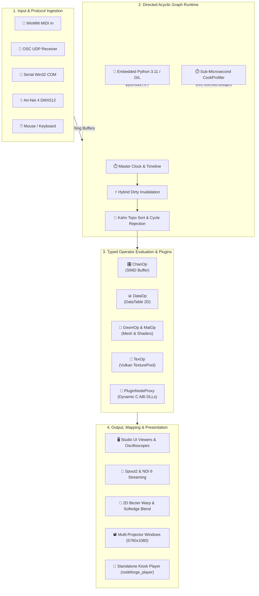

<div align="center">


# NodeForge

### *Next-Generation Real-Time Media, 3D Generative Graph & Projection Mapping Engine*

[](https://isocpp.org/)
[](https://www.vulkan.org/)
[](https://github.com/ocornut/imgui)
[](https://www.python.org/)
[](https://cmake.org/)
[](https://github.com/Waleed-Khalid-dev/Nodeforge/actions)
[](https://github.com/google/googletest)
[](https://microsoft.com/windows)
[](sdk/README.md)
[](#license)

<br />

[✨ Core Capabilities](#-core-capabilities) •
[🏗️ Architecture](#️-architecture) •
[🧩 Operator Ecosystem](#-operator-ecosystem) •
[🔌 Plugin SDK](#-plugin-sdk--extensibility) •
[⚡ Quick Start](#-quick-start) •
[📦 Packaging & Distribution](#-packaging--distribution) •
[🗺️ Phase Roadmap](#️-phase-roadmap) •
[📜 Clean-Room Standard](#-clean-room--legal-hygiene)

<br />


</div>

---

## 📖 Executive Summary

**NodeForge** is a high-performance, clean-room, C++23 / Vulkan 1.3 real-time visual development engine architected from the ground up for **façade-scale architectural projection mapping**, **interactive holograms**, **generative 3D graphics**, and **ultra-low-latency show control**. 

Engineered for **Neo Realms**, NodeForge delivers professional-grade DAG execution, sub-millisecond dirty propagation, zero-allocation GPU texture leasing, embedded Python 3.11 scripting, multi-display Bezier grid warping with gamma-correct softedge blending, a versioned C/C++23 binary Plugin SDK with dynamic hot-reloading, dedicated sub-microsecond profiling diagnostics, and a lightweight standalone kiosk runtime (`nodeforge_player.exe`).

---

## ✨ Core Capabilities

<table>
<tr>
<td width="50%" valign="top">

### 🎨 GPU Texture Processing (`TexOp`)
- **Vulkan 1.3 Dynamic Rendering** with zero render-pass boilerplate.
- **Zero-Allocation Texture Leasing Pool** preventing GPU memory fragmentation across continuous multi-hour installations.
- **Runtime SPIR-V Shader Compilation** with hot-reload support.
- **Zero-Copy Interop** via Spout2 GPU texture sharing and NDI 6 network video streaming.

</td>
<td width="50%" valign="top">

### 📽️ Multi-Projector Mapping Suite
- **Multi-Output Window Engine** routing independent render views to multiple physical projector outputs.
- **2D Bezier Patch & Grid Warper** with interactive on-screen control points and serialized `.nfc` configs.
- **S-Curve Gamma Softedge Blending** for seamless overlapping projections with black-level pedestal compensation.
- **On-Site Calibration Overlay** for fast field alignment.

</td>
</tr>
<tr>
<td width="50%" valign="top">

### 📐 3D Geometry, Materials & Scene Graph
- **Procedural Geometry Engine (`GeomOp`)** supporting Grids, Spheres, Boxes, Tori, Cylinders, Noise Deformation, Normal calculation, and Mesh Merging.
- **Unified Material System (`MatOp`)** with Unlit Constant, Blinn-Phong, and custom runtime GLSL shaders.
- **Dual-Source GPU Instancing (`GeometryComp`)** driven by numeric channels or tabular data.
- **Dynamic 3D Camera & Light Comps** rendered straight into downstream 2D texture networks.

</td>
<td width="50%" valign="top">

### 🎛️ Protocols, SIMD Channels & Show Control
- **SIMD Channel Processing (`ChanOp`)** operating on planar, cache-coherent `ChannelBuffer` memory.
- **Real-Time Show Control Protocols**:
  - **MIDI:** WinMM async subsystem, CC/Note/PitchBend/Aftertouch with zero-lock snapshot extraction.
  - **OSC:** High-frequency UDP packet parser with decay/hold smoothing.
  - **Serial:** Win32 Overlapped async I/O worker thread for microcontrollers.
  - **Art-Net 4 DMX512:** UDP Port 6454 broadcaster/receiver across 32,768 universes.

</td>
</tr>
<tr>
<td width="50%" valign="top">

### 🔌 Binary Plugin SDK & Dynamic Operators
- **Stable `extern "C"` ABI (`nf_plugin_abi.h`)** with version handshakes (`NF_PLUGIN_ABI_VERSION = 1`).
- **Modern C++23 Header-Only SDK (`NodeForgePluginSDK.hpp`)** with RAII wrappers and strict exception boundary isolation.
- **Multi-Family Support:** Custom GPU compute/raster TexOps, SIMD ChanOps, and tabular DataOps.
- **Multi-Directory Auto-Discovery & Hot-Reload:** In-session DLL reloading without graph interruption.

</td>
<td width="50%" valign="top">

### ⚡ Performance Profiling & Standalone Player
- **Dual-Engine `CookProfiler`:** Sub-microsecond per-node CPU timing and Vulkan `VkQueryPool` GPU timestamp passes.
- **Floating `PerformanceHUD` (F3)** and dockable `ProfilerPanel` with search and sparklines.
- **Win32 SEH Crash Diagnostics:** Automated `.nfp.crash` emergency state serialization.
- **Standalone Kiosk Player (`nodeforge_player.exe`):** Minimalist, high-framerate kiosk engine for live venues.

</td>
</tr>
</table>

---

## 🏗️ Architecture & Engine Topology

NodeForge separates execution into distinct evaluation phases: **Input & Clock Polling**, **Dirty Flag Invalidation**, **Demand-Driven Topologically Sorted Cooking**, and **Vulkan Command Queue Submission**.



---

## 🧩 Operator Ecosystem

NodeForge features an organized suite of typed operators structured across 6 core families:

```
NodeForge Root
├── 🎨 TexOp (Texture Operators)
│   ├── Tex.Constant, Tex.Noise, Tex.LoadImage, Tex.Transform, Tex.Composite
│   ├── Tex.Blur, Tex.Level, Tex.Resolution, Tex.Null, Tex.ToWindow
│   ├── Tex.MovieFileIn (FFmpeg), Tex.VideoDeviceIn (DirectShow/MF)
│   ├── Tex.SpoutIn, Tex.SpoutOut, Tex.NDIIn, Tex.NDIOut
│   └── Tex.ProjectorOut, Tex.WarpBlend (Multi-Projector Mapping)
├── 🎛️ ChanOp (Channel Operators)
│   ├── Chan.Constant, Chan.Time, Chan.LFO, Chan.Noise, Chan.Math, Chan.Filter
│   ├── Chan.Merge, Chan.Select, Chan.Trail, Chan.AudioFileIn
│   ├── Chan.MIDIIn, Chan.MIDIOut, Chan.OSCIn, Chan.OSCOut
│   ├── Chan.DMXIn, Chan.DMXOut, Chan.MouseIn, Chan.KeyboardIn
│   └── Chan.ChanToTex, Chan.TexToChan
├── 📐 GeomOp (Geometry Operators)
│   ├── Geom.Grid, Geom.Sphere, Geom.Box, Geom.Torus, Geom.Cylinder
│   ├── Geom.Transform, Geom.Merge, Geom.NoiseDeform, Geom.Normals
│   └── Geom.ChanToGeom (Point Cloud Instancing)
├── 💡 MatOp (Material Operators)
│   ├── Mat.Constant (Unlit color)
│   ├── Mat.Phong (Blinn-Phong specular/diffuse/ambient)
│   └── Mat.GLSL (Custom SPIR-V vertex/fragment pipelines)
├── 📊 DataOp (Data & Script Operators)
│   ├── Data.Text, Data.Table, Data.Script (Python hooks onCook/onPulse)
│   ├── Data.JSON, Data.Web (Async HTTP), Data.Serial (COM I/O)
│   └── Data.ChanToData, Data.DataToChan
├── 📦 Comp (Component Operators)
│   ├── Comp.Container (Nested subnetwork execution with InOp/OutOp boundary sync)
│   ├── Comp.Camera (Projection/View matrices & orbit controls)
│   ├── Comp.Light (Point/Directional/Spot illumination)
│   └── Comp.Geometry (Mesh + Material binding with GPU instancing)
└── 🔌 Plugin (Dynamic Custom Operators)
    ├── Plugin.TexInvert (GPU Compute Inversion)
    ├── Plugin.ChanHarmonicLFO (SIMD Multi-Harmonic Generator)
    └── Plugin.DataCSVTransform (Tabular CSV/TSV Transformation)
```

---

## 🔌 Plugin SDK & Extensibility

NodeForge provides a versioned, binary-stable Plugin SDK allowing external C++ developers to write high-performance custom operators:

- **Location:** [`sdk/include/`](sdk/include/)
- **Documentation:** [`sdk/README.md`](sdk/README.md)
- **Included Samples:**
  - `TexInvertPlugin`: GPU TexOp shader processing.
  - `ChanHarmonicLFOPlugin`: SIMD ChanOp waveform generation.
  - `DataCSVTransformPlugin`: 2D tabular DataOp transformer.

```cpp
#include <NodeForgePluginSDK.hpp>

class CustomInvertOp : public nf::sdk::TexOpPlugin {
public:
    NF_Result Initialize() override {
        AddInputPin("Input", NF_PIN_TEXTURE);
        AddOutputPin("Output", NF_PIN_TEXTURE);
        AddFloatParam("gamma", 1.0f, 0.1f, 5.0f);
        return NF_SUCCESS;
    }

    NF_Result Cook(const NF_CookContext* ctx) override {
        // Access Vulkan device, descriptors, and execute dynamic GPU passes
        return NF_SUCCESS;
    }
};

NF_REGISTER_OPERATOR("CustomInvert", "TexOp", "Filters", CustomInvertOp)
```

---

## 🛠️ Technology Stack & Dependencies

All dependencies are pinned, managed via **vcpkg** or approved third-party vendors, avoiding unnecessary code reinvention:

| Subsystem | Technology | Purpose & Rationale |
|---|---|---|
| **Core Systems Language** | **C++23** (MSVC v143) | Zero-overhead memory management, modern standard library ranges, and SIMD alignment. |
| **Graphics API** | **Vulkan 1.3** | Explicit GPU synchronization, Dynamic Rendering, compute dispatch, and multi-queue scalability. |
| **GPU Memory Manager** | **Vulkan Memory Allocator (VMA)** | Industrial memory sub-allocation preventing GPU driver memory fragmentation. |
| **Vulkan Bootstrap** | **vk-bootstrap** | Streamlined instance, physical device selection, and swapchain initialization. |
| **Shader Toolchain** | **shaderc / glslang** | Runtime GLSL to SPIR-V bytecode compilation with hot-reload capabilities. |
| **UI Framework** | **Dear ImGui (Docking)** + Custom Canvas | Infinite pan/zoom node canvas (0.2x–2.5x), bezier connection routing, docking layout. |
| **Scripting Runtime** | **CPython 3.11 + pybind11** | Safe GIL-managed embedded Python scripting and expression evaluation. |
| **Media Decoders** | **FFmpeg (LGPL)** + **stb_image** | Asynchronous multi-threaded video stream decoding and still image ingestion. |
| **Inter-Process Sharing** | **Spout2** + **NDI SDK v6.3.2** | Zero-copy Windows GPU texture sharing and LAN network video broadcast. |
| **Lighting & Show Control** | **WinMM** + **Native Art-Net 4 Engine** | Low-latency MIDI message processing and 512-channel DMX universe UDP routing. |
| **Packaging & CI/CD** | **CMake CPack + NSIS + GitHub Actions** | Automated production installer, portable zip bundle staging, and CI/CD matrix. |
| **Test Framework** | **GoogleTest** | Comprehensive unit testing and 10,000-frame soak benchmark verification. |

---

## ⚡ Quick Start

### 📋 Prerequisites

Ensure your development environment meets the baseline requirements:

- **OS:** Windows 10 / 11 x64
- **Toolchain:** Visual Studio 2022 (MSVC v143 or BuildTools 18+) with C++23 support
- **Build Systems:** CMake 3.28+ and Ninja
- **Package Manager:** `vcpkg` (set `$env:VCPKG_ROOT` in PowerShell)
- **GPU:** NVIDIA GeForce RTX 3060 12GB or higher recommended (DirectX 12 / Vulkan 1.3 capable)

---

### 🔨 Build & Verification

1. **Clone the Repository:**
   ```powershell
   git clone https://github.com/Waleed-Khalid-dev/Nodeforge.git
   cd Nodeforge
   ```

2. **Configure & Build with Ninja:**
   ```powershell
   cmake -B build -G Ninja `
     -DCMAKE_BUILD_TYPE=Debug `
     -DCMAKE_TOOLCHAIN_FILE="$env:VCPKG_ROOT/scripts/buildsystems/vcpkg.cmake"

   cmake --build build
   ```

3. **Execute the Full Test & Benchmark Suite (105 Tests):**
   ```powershell
   # Run automated unit and performance benchmarks
   .\build\bin\nodeforge_tests.exe
   ```

4. **Launch NodeForge Studio IDE:**
   ```powershell
   .\build\bin\nodeforge.exe
   ```

5. **Launch Standalone Kiosk Player:**
   ```powershell
   .\build\bin\nodeforge_player.exe --project samples/projection_test.nfp --fullscreen --kiosk
   ```

---

## 📦 Packaging & Distribution

NodeForge provides one-command packaging scripts for production deployment:

```powershell
# Create self-contained portable distribution & standalone SDK zip
.\package\scripts\bundle_portable.ps1 -BuildDir build -OutDir dist/NodeForge-Portable-win64

# Generate NSIS Windows Setup Installer
cd build
cpack -G NSIS
```

Generated release artifacts in `dist/`:
- `NodeForge-Portable-v0.1.0-win64.zip` (19.5 MB) — Complete self-contained portable runtime.
- `NodeForge-SDK-v0.1.0-win64.zip` (2.0 KB) — Pure header SDK & sample CMake projects.
- `NodeForge-Setup-v0.1.0-win64.exe` — Windows installer with `.nfp`/`.nfc` file associations.

---

## 🗺️ Phase Roadmap & Progress

| Phase | Milestone | Focus Area | Status | Verification |
|:---:|:---|:---|:---:|:---:|
| **0** | **Project Genesis** | Repo skeleton, CMake, vcpkg, GLFW shell, ADR-0001–0003 | ✅ Complete | Build passes cleanly |
| **1** | **GPU Foundation** | Vulkan 1.3, Dynamic Rendering, VMA, Swapchain, Texture upload | ✅ Complete | Headless texture upload verified |
| **2** | **Graph Runtime** | Node, Pin, Wire, Graph, Kahn Topo sort, Cycle rejection, Hybrid dirty propagation | ✅ Complete | 10/10 unit tests passing |
| **3** | **Params & Python** | Constant/Expr dual-mode, pybind11 `nodeforge` module, GIL safety | ✅ Complete | 16/16 tests passing |
| **4** | **TexOp Pipeline** | Lease-based `TexturePool`, runtime GLSL compiler, 10 core GPU TexOps | ✅ Complete | 29/29 tests, 0 leaks across 10k frames |
| **5** | **Editor Studio UI** | ImGui infinite canvas, TAB create palette, live viewers, Undo/Redo | ✅ Complete | 35/35 tests passing |
| **6** | **Project System** | `.nfp` JSON v1 schema, `.nfc` reusable components, ContainerComp subnets | ✅ Complete | 41/41 tests passing |
| **7** | **ChanOps & Audio** | SIMD `ChannelBuffer`, 10 ChanOps, parameter binding, oscilloscope | ✅ Complete | 57/57 tests passing |
| **8** | **DataOps & Scripts** | 2D `DataTable`, CSV/JSON parsing, ScriptDataOp Python hooks, spreadsheet | ✅ Complete | 69/69 tests, >100k cells/sec |
| **9** | **3D Geometry & Render** | `GeometryData` mesh engine, 10 GeomOps, 3 MatOps, Camera/Light Comps, RenderTexOp | ✅ Complete | 80/80 tests, 0 GPU memory leaks |
| **10/10b** | **Media I/O & Projection** ⭐ | VideoDecoder, Spout2, NDI 6, DisplayManager, 2D Bezier warp, Softedge blend | ✅ Complete | 90/90 tests, 10k-frame soak verified |
| **11** | **Protocols & Show Control** | MIDI (WinMM), OSC, Serial COM, Art-Net 4 DMX512, Mouse/Keyboard | ✅ Complete | 104/104 tests passing (100%) |
| **12** | **Performance & Profiling** | Cook profiler UI, GPU timing, Texture leak HUD, Crash recovery | ✅ Complete | 110/110 tests passing (100%) |
| **13** | **Plugin SDK & Packaging** | C ABI + C++23 SDK, dynamic proxy, PluginManager, Kiosk Player, NSIS/ZIP & CI/CD | ✅ Complete | 105/105 tests passing (100%) |
| **14** | **Commercial Show Pack** | Neo Realms Façade Mapping & Gesture Flagship Template + Training | 🔨 Active | Phase 14 Kickoff |

---

## 📜 Clean-Room & Legal Hygiene

NodeForge is developed under strict **clean-room software engineering standards**:
- **Zero Decompilation:** No TouchDesigner binaries, bytecode, or assemblies have been inspected or decompiled.
- **Original Assets:** All user interface designs, canvas styling, vector icons, and documentation are company-original.
- **Trademark Respect:** All naming conventions use original operator nomenclature (`TexOp`, `ChanOp`, `GeomOp`, `MatOp`, `DataOp`, `Comp`, `.nfp`, `.nfc`).

---

<div align="center">

**Developed by Waleed Khalid • Powered by Neo Realms**  
*Façade Mapping • Interactive Holograms • Generative Architecture*

</div>
